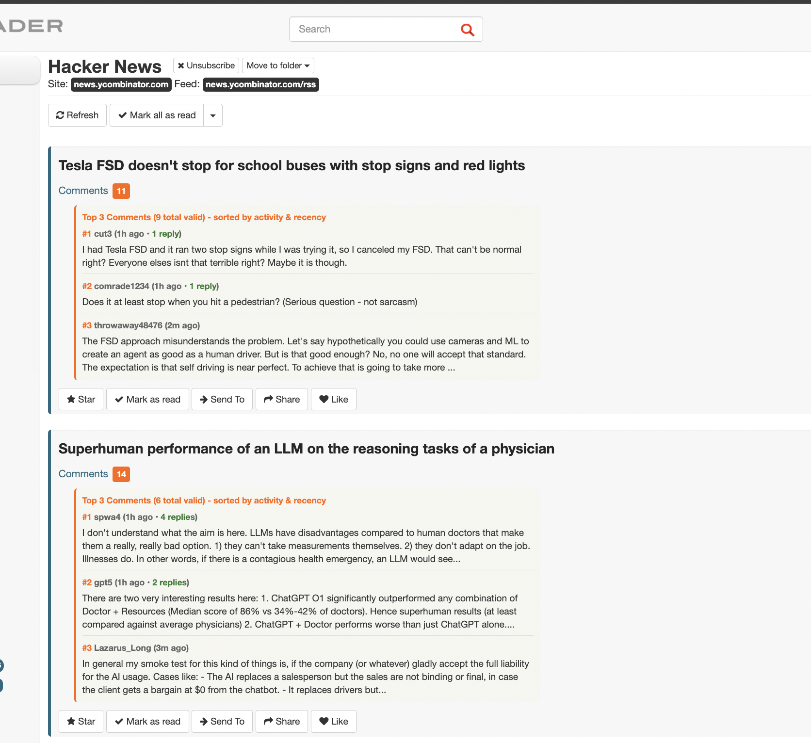

# HN Comments Counter for The Old Reader

A Chrome extension that automatically adds comment counts and displays top comments for Hacker News links in The Old Reader RSS feed.



## Why This Extension?

I love reading Hacker News through [The Old Reader](https://theoldreader.com) RSS aggregator, but I always missed the comment counts and discussion context. This extension bridges that gap by:

- **📊 Adding comment badges** next to HN links with live counts from the official API
- **💬 Showing top comments** directly in the feed (configurable 0-10 comments)
- **🔄 Working automatically** as you scroll and load new posts
- **⚡ Being lightweight** with smart rate limiting and minimal API calls

## Features

✅ **Live comment counts**: Orange badges showing total comments  
✅ **Top comments display**: See the best-scored comments without leaving your reader  
✅ **Configurable**: Choose how many comments to show (0 disables, just shows counts)  
✅ **Smart sorting**: Comments ranked by score, activity, and recency  
✅ **Clean formatting**: HTML stripped and text truncated for readability  
✅ **Dynamic detection**: Works with infinite scroll and new posts  
✅ **No duplicates**: Prevents reprocessing the same links  

## How It Works

The extension:
1. Scans The Old Reader for HN item links (`news.ycombinator.com/item?id=...`)
2. Fetches comment count from the official HN Firebase API
3. Adds orange badges with the count next to each link
4. If enabled, fetches and displays top-level comments sorted by score
5. Monitors for new posts loaded during scrolling

## Installation

### Option 1: Chrome Extension (Recommended)
1. Download or clone this repository
2. Open Chrome and go to `chrome://extensions/`
3. Enable "Developer mode" in the top right
4. Click "Load unpacked extension"
5. Select this extension's folder

### Option 2: Bookmarklet
Create a bookmark with this JavaScript code and click it when on The Old Reader:

```javascript
// See bookmarklet.js for the standalone version
```

## Configuration

Access the extension settings through Chrome's extension menu:

- **Comment display**: Choose 0-10 comments to show
- **0 = disabled**: Only shows comment counts, no comment text
- **Default**: 3 comments
- Changes apply immediately to open tabs

## Technical Details

**Built with:**
- Manifest V3 for modern Chrome extensions
- Official Hacker News Firebase API
- MutationObserver for dynamic content detection
- Promise-based async/await for clean API handling
- Smart rate limiting to avoid overwhelming the API

**Performance optimizations:**
- Batched API requests (3 at a time)
- Debounced scroll detection
- Link deduplication tracking
- Truncated comment text (300 chars max)
- Only fetches first 10 comments per story for analysis

## Code Structure

```
manifest.json     # Extension configuration
content.js        # Main script (runs on theoldreader.com)
options.html      # Settings page
options.js        # Settings logic
icons/           # Extension icons (16x16, 48x48, 128x128)
```

## API Usage

The extension uses the public Hacker News API:
- Story data: `https://hacker-news.firebaseio.com/v0/item/{id}.json`
- No authentication required
- Rate limited to be respectful to the service

## Contributing

This is a personal utility that became useful enough to share. Feel free to:
- Report issues or suggest improvements
- Submit pull requests
- Fork for your own RSS reader modifications

## Privacy

The extension:
- Only runs on theoldreader.com
- Makes requests only to the official HN API
- Stores only your comment count preference locally
- No data collection, tracking, or external services

## License

MIT License - Feel free to use, modify, and distribute.

---

*Built by someone who loves both RSS feeds and Hacker News discussions. Hope it helps other Old Reader users stay connected to the HN community!*